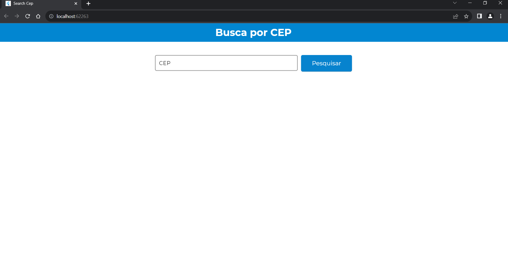
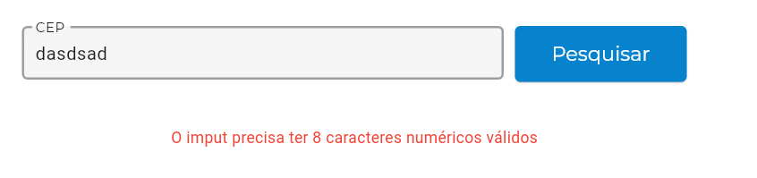
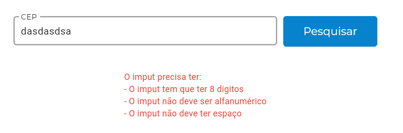
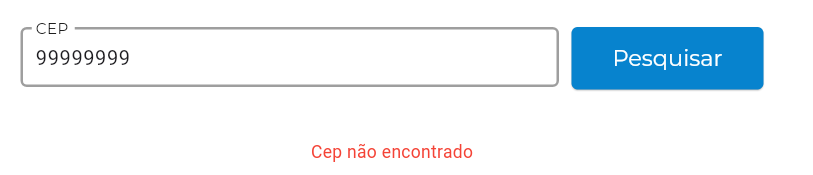
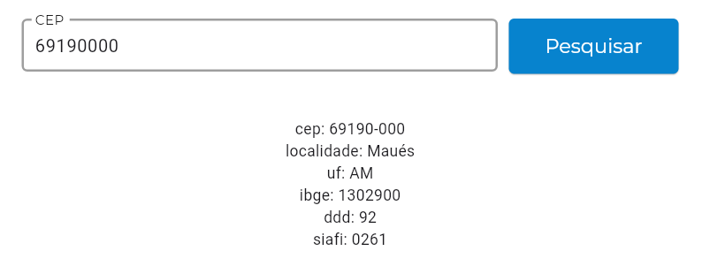
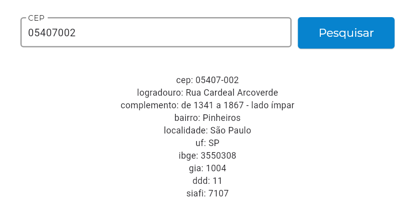

# Buscar de CEP

### Visão geral
- Aplicação em Flutter Web
- Buscar de cep BR usando [API - VIACEP](https://viacep.com.br/)
- Aplicando conceito de injeção de depedêncais com [Flutter Modular](https://pub.dev/packages/flutter_modular)
- Aplicando conceito de gerenciamento de estado com [Flutter BLOC](https://pub.dev/packages/flutter_bloc/example)

### Pendêncais
- Melhorar a apresentação dos dados (UI)

### Screen
- **HOME PAGE**

- **TRATATIVAS DE ERRO**

- **CEP VÁLIDO**

Traz somente informações que não estão vazias

# Instalação e Configuração 

## Instalação do Flutter, siga os passos abaixo:

1. **Download do Flutter**: Acesse o [link](https://docs.flutter.dev/get-started/install/windows/desktop?tab=download) e extraia o SDK para o diretório raiz (`Disco Local (C:)`).

2. **Adicione ao Path**: Adicione o caminho `C:\flutter\bin` às variáveis de ambiente do sistema. Veja como fazer [aqui](https://support.microsoft.com/pt-br/topic/como-gerenciar-vari%C3%A1veis-de-ambiente-no-windows-xp-5bf6725b-655e-151c-0b55-9a8c9c7f747d#:~:text=Para%20exibir%20ou%20alterar%20vari%C3%A1veis,Clique%20em%20Vari%C3%A1veis%20de%20ambiente.).

3. **Execução**: No prompt de comando em modo administrador, execute `flutter doctor` para verificar o que está faltando para executar o Flutter. A ideia é que o resultado seja semelhante a este:

## Build da Aplicação

Após baixar o repositório [KatyFestasCatalog
](https://github.com/ClaudioMarzo/KatyFestasCatalog.git), execute os seguintes comandos:

### Reconstrução do Projeto
- `flutter clean`
- `flutter build web`
- `flutter run`

### Instalando dependências:
- `flutter pub get`

### Atualizando dependências:
- `flutter pub upgrade`

### Verificando atualização de dependências:
- `flutter pub outdated`

